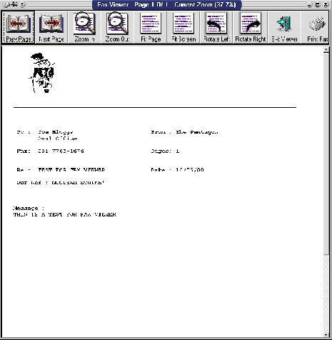



## FaxViewer

### Description

This a fully functioning Fax/Image viewer

it can be used to view a multi page TIFF file or multiple single page image files names (for example :- page1.bmp page2.bmp etc)

just place the image files in the applications directory and run the project
 
### More Info
 
This project requires the Wang image controls

ImgEdit.ocx (comes already installed as part of Win98)

             |
---                |---
**Submitted On**   |2000-06-10 20:11:56
**By**             |[MrEnigma](https://github.com/Planet-Source-Code/PSCIndex/blob/master/ByAuthor/mrenigma.md)
**Level**          |Intermediate
**User Rating**    |4.5 (36 globes from 8 users)
**Compatibility**  |VB 5\.0, VB 6\.0
**Category**       |[Complete Applications](https://github.com/Planet-Source-Code/PSCIndex/blob/master/ByCategory/complete-applications__1-27.md)
**World**          |[Visual Basic](https://github.com/Planet-Source-Code/PSCIndex/blob/master/ByWorld/visual-basic.md)
**Archive File**   |[CODE\_UPLOAD66156102000\.zip](https://github.com/Planet-Source-Code/mrenigma-faxviewer__1-8800/archive/master.zip)

